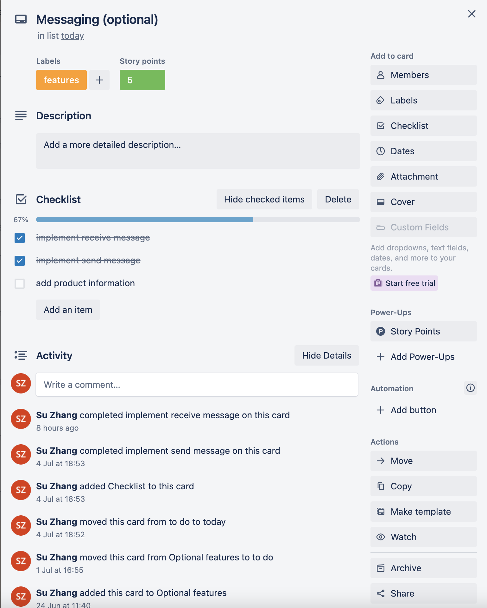

# Marketplace Project - Su Zhang

## Explain how the MVC architecture and concept of inheritance impact the structure of your application and the entities within it
(Precisely explains and shows understanding of how the MVC architecture and concept of inheritance impact the structure of your application and the entities within it)


## R7 Identification of the problem you are trying to solve by building this particular marketplace app.

Society values the latest trends, the most fashionable clothing and the most stylish looks, and we rarely think about the environmental impact of our shopping habits. The desire to supply the latest fashion trends in abundance at low prices has led to the fashion industry becoming one of the world's major polluting industries. The industry is responsible for nearly 10% of greenhouse gas emissions, mainly due to the overproduction of clothing to meet consumer demand for "fast fashion". Things are cheap and throwaway, with only about 20% of clothing Recycled or reused, while vast quantities of fashion products end up in landfills or incinerated, creating huge carbon emissions. This call for cheap clothing to keep up with changing trends has devastating effects on our climate.

### References:

- [Climate crisis drives shift towards sustainable fashion](https://www.wipo.int/ip-outreach/zh/ipday/2020/articles/sustainable_fashion.html)

---

## R8 Why is it a problem that needs solving?

Clothes have traditionally been made from materials derived from plants and animals, such as cotton, linen and leather, but today's clothing is increasingly likely to be made from materials derived from fossil fuel crude oil to make nylon and polyester and more synthetic fibres. These materials do not biodegrade, which means significant damage to the environment and devastating effects on human health and wildlife.
At the same time, the high water consumption in the production of clothing, chemical pollution from dyeing and processing, and the disposal of large quantities of unsold or discarded clothing through incineration or landfilling can all cause serious harm to the environment. Therefore, in order to make our world a better place, this should be given enough attention.

### References:

- [Fashion forward: How to combat climate change through clothing](https://www.imperial.ac.uk/stories/fashion-forward/)


---

## R9 A link (URL) to your deployed app (i.e. website)

[App Link](https://vintagemarket.herokuapp.com/)

---

## R10 A link to your GitHub repository (repo).

[Github Repo Link](https://github.com/coderGirlSu/SuZhang_T2A2)

---

## R11 Description of your marketplace app (website), including:

### Purpose

As the problem of global warming worsens, and the popularity of fast fashion brands. Little attention has been paid to the impact of the shopping habits that people develop to follow trends in our living environment. Therefore, I designed this two-sided marketplace, which is based on the protection of the environment to encourage everyone to recycle their own effective resources, sell or buy their own old items, and develop shopping habits that are not wasteful, so as to protect our only and beautiful earth.

### Functionality / features

**Hamburger menu:** This website is responsive, which means it shows hamburger menu when the screen size is under 1200px instead of showing navbar.

**My orders:** This page will list all the products I have ordered, users will be able to view all their orders on this page.

**My products:** This page will list all of the products that I have posted. it is easy for users manage their products.

**Searching bar:** The search bar located on the top of the products and my products page allows users to search their interested products and also narrow down the range of searching.

**Messaging:** As sellers, they will be able to check their messages from message section where located on the top of the website, which is the part of the navbar. as buyers, they will be able to contact the seller through message section, or click on the contact button where is in the product page.

**Image uploading:** Users will be able to upload the image of the product which they want to sell. The images are stored in the postgres database. 

**Edit and Add a product:** Users will be able to edit, delete, add new products to their website. 

**Rich text:** Rich Text is a field type that enables users to create rich text content, It provides common text formatting options such as paragraphs, adding files, etc.

**Authentication:** Divise 

**Authorization:** Users have restrictions on what they can see and edit. 


### Sitemap


### Screenshots

Home Page

Products Page

Product Buyer-Page

Product Seller-Page

Editing Page

Add New Product Page

Contact Page

Success Page

Sold Out Page

Condition Guide Page

My Products Page

My Orders Page

Message list Page

Reply message Page


### Target audience

The target audience is all people who pay attention to and value global warming and environmental protection, as well as vintage lovers. In this vintage market app, users can sell their old items as sellers, and can also buy their favourite vintage items from other sellers. On this platform, people’s purchasing habit of recycling not only facilitates users to dispose of their old items but also reduces the environmental pollution caused by high carbon emissions when incinerating discarded items.

### Tech stack (e.g. html, css, deployment platform, etc)
(discrib!!!!!)
- Visual Studio Code
- Ruby on Rails
- Ruby
- Postgresql- database in development and production
- draw.io - Drawing ERD 
- XMind - Sitemap
<!-- - Bootstrap - css framework  -->
- Heroku - Website hosting
- HTML - Layout
- CSS -styling
- Balsamiq Wireframes
- GitHub - source control

---

## R12 User stories for your app

User's perspective:

- As a user, I want to be able to register and log in to the site, so that I can sell my products or buy products.

Buyer's perspective:

- As a buyer, I want to be able to search for related items, so that I can find items I'm interested in faster.
- As a buyer, I want to see a list of the items I've purchased，so that I can easily see all the information about the items I've purchased.
- As a buyer, I want to send messages to sellers, so that I can easily inquire about the specifics of the item I want to buy.
- As a buyer, I want to understand the terms that describe the condition of used goods, so that I can know the condition of the goods before I purchase something.
- As a buyer, I want to be able to purchase goods and confirm that the purchase has been successful, so that I can obtain the goods I like and be confident the purchase was successful.
- As a buyer, I want to know which items are sold out, so that I don't try to buy them.
- As a buyer, I want to see all product listings without registering or logging in, so that I can be sure if this is the type of site I'm looking for.

Seller's perspective:

- As a seller, I want to have a section that displays all of my products listing, so that I can easily see how all of my listings are selling.
- As a seller, I want to have a section where I can view and reply to messages, so that I can easily view all the inquiries sent to me by buyers and reply in a timely manner.
- As a seller, I want the picture and link of the corresponding product can be attached to the buyer's inquiry message, so that I can clearly know which product the buyer is inquiring about and quickly find the information for the product.
- As a seller, I want to have an obvious and convenient button to add new items, so that I can add items that I want to sell at any time.
- As a seller, I want to be able to edit my products, so that I can update or delete the products I list at any time, and also buyers can get the latest product information.
- As a seller, I want to be able to upload images and describe items' conditions, so that buyers can clearly know the detailed condition of the product.

---

## R13 Wireframes for your app

Home Page

Products Page

Product Buyer-Page

Product Seller-Page

Editing Page

Add New Product Page

Contact Page

Success Page

Sold Out Page

Condition Guide Page

My Products Page

My Orders Page

Message list Page

Reply message Page


---

## R14 An ERD for your app


---

## R15 Explain the different high-level components (abstractions) in your app


---

## R16 Detail any third party services that your app will use

Heroku (Web hosting service) - Heroku is a Platform as a Service (PaaS) which provides a set of capabilities that allows me to deploy, manage and host my website. I was chosen because it no need to understand server configuration, network management, or tune the latest version of the database.

Github
I was using Github to host my source code and keep track of the various changes, it makes esaier to reviewing, improving, and delivering new features and  making a better workflow. And also to deploy code through Github to Heroku.

Devise: I used Devise gem to generated a User model in rails as an authentication system. Because, Devise take care of all the controllers necessary for User, like log in and out, email, password for registration. And also allows me to add username section which is very flexible and easy to setup. 

---

## R17 Describe your projects models in terms of the relationships (active record associations) they have with each other

has many 
belongs to
A user if set up under the role of a 'restaurant' is able to create many restaurants (has_many). This is to cover scenarios where one user login has multiple relationships.

A restaurant can only belong to one user (belongs_to). This is to ensure that a user who did not create the resturant cannot edit or delete a restaurant created by another user. All restaurants can view other restaurants listed on the app, in order to be able to view what customers can view on the index.

A restaurant can upload an image attached to the listing.

A user can have many sign in's as a user can check into many restaurants on the app (has_many). This enables the user to view a list of all their CheckIn's (i.e. where they have been) on the app. The restaurant the user CheckedIn can be viewed on the index page.

A user can provide many feedbacks to the restaurant (has_many). Each feedback is linked to the user ID and restaurant ID ensuring that the correct customer and restaurant user can view the app.

A user can upload an image attached to the feedback. This includes scenarios where they want to include a picture of the food, reciept, etc.
---

## R18 Discuss the database relations to be implemented in your application


---

## R19 Provide your database schema design

Active text rich text table

```rb
  create_table "action_text_rich_texts", force: :cascade do |t|
    t.string "name", null: false
    t.text "body"
    t.string "record_type", null: false
    t.bigint "record_id", null: false
    t.datetime "created_at", null: false
    t.datetime "updated_at", null: false
    t.index ["record_type", "record_id", "name"], name: "index_action_text_rich_texts_uniqueness", unique: true
  end
```

Active storage attachments table

```rb
create_table "active_storage_attachments", force: :cascade do |t|
    t.string "name", null: false
    t.string "record_type", null: false
    t.bigint "record_id", null: false
    t.bigint "blob_id", null: false
    t.datetime "created_at", null: false
    t.index ["blob_id"], name: "index_active_storage_attachments_on_blob_id"
    t.index ["record_type", "record_id", "name", "blob_id"], name: "index_active_storage_attachments_uniqueness", unique: true
  end
```

Active storage blobs table

```rb
 create_table "active_storage_blobs", force: :cascade do |t|
    t.string "key", null: false
    t.string "filename", null: false
    t.string "content_type"
    t.text "metadata"
    t.string "service_name", null: false
    t.bigint "byte_size", null: false
    t.string "checksum"
    t.datetime "created_at", null: false
    t.index ["key"], name: "index_active_storage_blobs_on_key", unique: true
  end
```

Active storage database files (used for image uploading)

```rb
create_table "active_storage_db_files", force: :cascade do |t|
    t.string "ref", null: false
    t.binary "data", null: false
    t.datetime "created_at", precision: nil, null: false
    t.index ["ref"], name: "index_active_storage_db_files_on_ref", unique: true
  end
```

Active storage variant records (for edits to images)

```rb
 create_table "active_storage_variant_records", force: :cascade do |t|
    t.bigint "blob_id", null: false
    t.string "variation_digest", null: false
    t.index ["blob_id", "variation_digest"], name: "index_active_storage_variant_records_uniqueness", unique: true
  end
```

Category database table

```rb
create_table "categories", force: :cascade do |t|
    t.string "name"
    t.datetime "created_at", null: false
    t.datetime "updated_at", null: false
  end
```

Message database table

```rb
 create_table "messages", force: :cascade do |t|
    t.text "message"
    t.bigint "product_id", null: false
    t.date "date"
    t.bigint "sender_id", null: false
    t.bigint "receiver_id", null: false
    t.datetime "created_at", null: false
    t.datetime "updated_at", null: false
    t.index ["product_id"], name: "index_messages_on_product_id"
    t.index ["receiver_id"], name: "index_messages_on_receiver_id"
    t.index ["sender_id"], name: "index_messages_on_sender_id"
  end
```

Order database table

```rb
create_table "orders", force: :cascade do |t|
    t.bigint "product_id", null: false
    t.bigint "buyer_id", null: false
    t.bigint "seller_id", null: false
    t.date "date"
    t.boolean "paid"
    t.datetime "created_at", null: false
    t.datetime "updated_at", null: false
    t.index ["buyer_id"], name: "index_orders_on_buyer_id"
    t.index ["product_id"], name: "index_orders_on_product_id"
    t.index ["seller_id"], name: "index_orders_on_seller_id"
  end
```

Product database table

```rb
create_table "products", force: :cascade do |t|
    t.string "title"
    t.boolean "sold", default: false
    t.bigint "category_id", null: false
    t.bigint "user_id", null: false
    t.integer "price"
    t.integer "colour"
    t.integer "condition"
    t.date "listed_date"
    t.datetime "created_at", null: false
    t.datetime "updated_at", null: false
    t.index ["category_id"], name: "index_products_on_category_id"
    t.index ["user_id"], name: "index_products_on_user_id"
  end
```

User database table

```rb
create_table "users", force: :cascade do |t|
    t.string "email", default: "", null: false
    t.string "encrypted_password", default: "", null: false
    t.string "reset_password_token"
    t.datetime "reset_password_sent_at"
    t.datetime "remember_created_at"
    t.string "username"
    t.datetime "created_at", null: false
    t.datetime "updated_at", null: false
    t.string "address"
    t.index ["email"], name: "index_users_on_email", unique: true
    t.index ["reset_password_token"], name: "index_users_on_reset_password_token", unique: true
  end
```

Foreign Keys

```rb
  add_foreign_key "active_storage_attachments", "active_storage_blobs", column: "blob_id"
  add_foreign_key "active_storage_variant_records", "active_storage_blobs", column: "blob_id"
  add_foreign_key "messages", "products"
  add_foreign_key "messages", "users", column: "receiver_id"
  add_foreign_key "messages", "users", column: "sender_id"
  add_foreign_key "orders", "products"
  add_foreign_key "orders", "users", column: "buyer_id"
  add_foreign_key "orders", "users", column: "seller_id"
  add_foreign_key "products", "categories"
  add_foreign_key "products", "users"
```

---

## R20 Describe the way tasks are allocated and tracked in your project

The tool I used to manage my project was Trello. Trello is a free visual organisation tool that uses a Kanban workflow style to track tasks and manage workflows.

I used a Trello board to allocate and track my project, the board was arranged in 5 columns, they were:

- Optional features - records the tasks I want to implement, but are not mandatory requirements
- To do - records the tasks that must be done are in the To do list column
- Doing - records the tasks that I am doing, but are not necessarily being done today
- Today - records the tasks that have to be completed today
- Done - records completed tasks, to make sure I've done all the tasks

### Task properties

Each task has a label and story points. I created 7 labels to organise each ticket, they are presentation, database, features, blocked, slides and documentation. The story points categorize difficulty levels and use the Fibonacci sequence. The Trello board screenshots and the link are shown below.

[Trello Board Link](https://trello.com/b/D1Iluvdr/marketpalce)

### My process

Every day I select a few tasks from the Doing list that I want to complete and move them to the Today list. This helps me focus on what needs to be done right now. Once tasks are complete, I move them to the Done list. If I become blocked on a task I can park it in Doing and focus on a different task in the Today list.

Once the Today list is empty I select more tasks from the Doing list and move them to the Today list. 

If all the To Do tasks are completed, I will move another ticket from the Optional features list over to the Doing list. 

### Trello board Screenshot





---