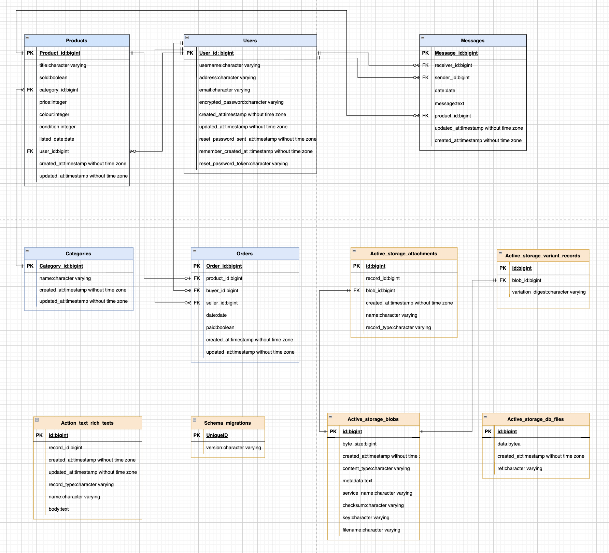

# Marketplace Project - Su Zhang

## R7 Identification of the problem you are trying to solve by building this particular marketplace app.

Society values the latest trends, the most fashionable clothing and the most stylish looks, and we rarely think about the environmental impact of our shopping habits. The desire to supply the latest fashion trends in abundance at low prices has led to the fashion industry becoming one of the world's major polluting industries. The industry is responsible for nearly 10% of greenhouse gas emissions, mainly due to the overproduction of clothing to meet consumer demand for "fast fashion". Things are cheap and throw away, with only about 20% of clothing Recycled or reused, while vast quantities of fashion products end up in landfills or incinerated, creating huge carbon emissions. This call for cheap clothing to keep up with changing trends has devastating effects on our climate.

### References:

- [Climate crisis drives shift towards sustainable fashion](https://www.wipo.int/ip-outreach/zh/ipday/2020/articles/sustainable_fashion.html)

---

## R8 Why is it a problem that needs solving?

Clothes have traditionally been made from materials derived from plants and animals, such as cotton, linen and leather, but today's clothing is increasingly likely to be made from materials derived from fossil fuel crude oil to make nylon and polyester and more synthetic fibers. These materials do not biodegrade, which means significant damage to the environment and devastating effects on human health and wildlife.
At the same time, the high water consumption in the production of clothing, chemical pollution from dyeing and processing, and the disposal of large quantities of unsold or discarded clothing through incineration or landfilling can all cause serious harm to the environment. Therefore, in order to make our world a better place, this should be given enough attention.

### References:

- [Fashion forward: How to combat climate change through clothing](https://www.imperial.ac.uk/stories/fashion-forward/)

---

## R9 A link (URL) to your deployed app (i.e. website)

[App Link](https://vintagemarket.herokuapp.com/)

---

## R10 A link to your GitHub repository (repo).

[Github Repo Link](https://github.com/coderGirlSu/SuZhang_T2A2)

---

## R11 Description of your marketplace app (website), including:

### Purpose

### Functionality / features

### Sitemap

### Screenshots

### Target audience

The target audience for this app will be vintage clothes enthusiasts who Interested in collecting unique and special stuff.

### Tech stack (e.g. html, css, deployment platform, etc)

- Visual Studio Code
- Rails
- Ruby
- Postgresql database
- draw.io - Drawing ERD and sitemap
<!-- - Stripe - payment platform
- Bootstrap - css framework -->
- Heroku - Web hosting
- HTML
- CSS
- Balsamiq Wireframes

---

## R12 User stories for your app

- As a user, I want to have an user section where I can view all my purchase and post, and also I can sign in/sign out and delete my own account.
- As a user, I want to have a search bar where I can search the specific items which I want.
- As a user, I want to be able to view all listing of items sorted by Category.
- As a user, I want to be able to contact seller/buyer via message for asking/answer questions.

<!-- As a User, I want to be able to see the list of robots on the website, so that I know what robots are available.
As a User, I want to be able to sort and filter the robots, so that I can find robots I am interested in quicker.
As a Signed up User, I want to be able to log into the site, so that I can access my account.
As a Logged in User, I want to sign out, so that I can end my session on the site.
As a Logged in User, I want to edit my information, so that if my information changes I can update it.
As a Logged in User, I want to delete my profile, so that remove my information from the system when I no long want it.
As a Buyer, I want to see my previous purchases, so that I can see what robots I have bought before.
As a Buyer, I want to be able to purchase a robot , so that I can take it home and use it.
As a Buyer, I want to receive a confirmation email, so that I have know the order has gone through and I have record of it.
As a Seller, I want to be able to post robots to sell, so that a buyer can purchase them.
As a Seller, I want to update my robot posts, so that if information is incorrect I can edit it.
As a Seller, I want to remove my robot posts, so that if I no longer want to sell the robot it can be taken off the site .
As a Seller, I want to see all the robots I have posted, so that I know which robots I have put up for sale.
As a Seller, I want to see which robots have been sold, so that I can figure out which are the popular ones.
As a Seller, I want to be able to upload images, so that I can show users what my robot looks like.

As a user, I want to have a profile page where I can easily update myself.
As a user, I want to view all listings, filter listings to find neary-by listings.
As a user, I want to create my ownn listing and be able to manage this individually and also collectively, such as a edit function after a listing is created.
As a user, I want to buy other users' listings using credit card in a safe enviroment.
As a user, I want to be able to delete my own account.
As a user, I want to have confidence that only myself can make modications to my own profile page and any listing I may have.
As a user, I want to be able to view all listings without having to log in to do so.
As a user, I want to be able to contact the app owner if I have any questions or have any complaints
As a user, I want to be able to contact the seller of a listing and ask many questions. -->

---

## R13 Wireframes for your app

Home Page

Products Page

Product Buyer-Page

Product Seller-Page

Editing Page

Add New Product Page

Contact Page

Success Page

Sold Out Page

Condition Guide Page

My Products Page

My Orders Page

Message list Page

Reply message Page

---

## R14 An ERD for your app

---

## R15 Explain the different high-level components (abstractions) in your app

---

## R16 Detail any third party services that your app will use

---

## R17 Describe your projects models in terms of the relationships (active record associations) they have with each other

---

## R18 Discuss the database relations to be implemented in your application

---

## R19 Provide your database schema design

---

## R20 Describe the way tasks are allocated and tracked in your project
I was using Trello board to allocate and track my project, I have 5 columns to consider, they are Optional features, to do, doing, today and done. 

Optional features:
The Optional features stores the functions I want to implement, but it is not mandatory requirement. 

To do
The tasks that must be done will be in the To do list, selecting some tasks I want to complete today or the tasks that will be completed move to the Today and Doing lists. Once I completed all the tasks from this column, I can move another ticket from Optional features to this column.

Doing
The doing list will store the tasks that I will do, but it doesn't have to be done today, if the list in Today list is empty, I can select the task from this list and move it to the today list.

Today
The today table stores the tasks have to be completed today. Every day，I select a few tasks from the Doing list to this list.

Done
Done list stores completed tasks，to make sure I've done all the tasks.

And also, each ticket has a label and story points. I created 7 labels to organise each ticket, they are presentation, database, features, blocked, slides, documentation. The story points categorize difficulty levels. The Trello board screenshots and the link are shown below.

[Trello Board Link](https://trello.com/b/D1Iluvdr/marketpalce)

### Trello board Screenshot

---