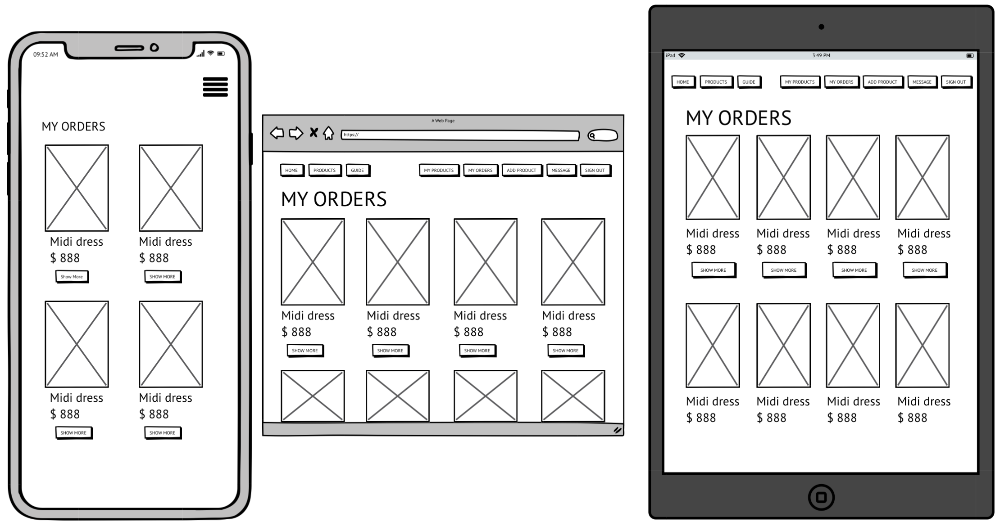

# Marketplace Project - Su Zhang

## R7 Identification of the problem you are trying to solve by building this particular marketplace app.

Society values the latest trends, the most fashionable clothing and the most stylish looks, and we rarely think about the environmental impact of our shopping habits. The desire to supply the latest fashion trends in abundance at low prices has led to the fashion industry becoming one of the world's major polluting industries. The industry is responsible for nearly 10% of greenhouse gas emissions, mainly due to the overproduction of clothing to meet consumer demand for "fast fashion". Things are cheap and throw away, with only about 20% of clothing Recycled or reused, while vast quantities of fashion products end up in landfills or incinerated, creating huge carbon emissions. This call for cheap clothing to keep up with changing trends has devastating effects on our climate.

### References:

- [Climate crisis drives shift towards sustainable fashion](https://www.wipo.int/ip-outreach/zh/ipday/2020/articles/sustainable_fashion.html)

---

## R8 Why is it a problem that needs solving?

Clothes have traditionally been made from materials derived from plants and animals, such as cotton, linen and leather, but today's clothing is increasingly likely to be made from materials derived from fossil fuel crude oil to make nylon and polyester and more synthetic fibers. These materials do not biodegrade, which means significant damage to the environment and devastating effects on human health and wildlife.
At the same time, the high water consumption in the production of clothing, chemical pollution from dyeing and processing, and the disposal of large quantities of unsold or discarded clothing through incineration or landfilling can all cause serious harm to the environment. Therefore, in order to make our world a better place, this should be given enough attention.

### References:

- [Fashion forward: How to combat climate change through clothing](https://www.imperial.ac.uk/stories/fashion-forward/)


---

## R9 A link (URL) to your deployed app (i.e. website)

[App Link](https://vintagemarket.herokuapp.com/)

---

## R10 A link to your GitHub repository (repo).

[Github Repo Link](https://github.com/coderGirlSu/SuZhang_T2A2)

---

## R11 Description of your marketplace app (website), including:

### Purpose

As the problem of global warming worsens, and the popularity of fast fashion brands. Little attention has been paid to the impact of the shopping habits that people develop to follow trends on our living environment. Therefore, I designed this two-sided marketplace, which is based on the protection of the environment to encourage everyone to recycle their own effective resources, sell or buy their own idle items, and develop shopping habits that are not wasteful, so as to protect our only and beautiful earth.

### Functionality / features

Hamburger menu

Searching bar

Messaging 

Image uploading

Rich text


### Sitemap


### Screenshots

Home Page

Products Page

Product Buyer-Page

Product Seller-Page

Editing Page

Add New Product Page

Contact Page

Success Page

Sold Out Page

Condition Guide Page

My Products Page

My Orders Page

Message list Page

Reply message Page


### Target audience

The target audience is all people who pay attention to and value global warming and environmental protection, as well as vintage lovers. In this vintage market, users can sell their idle items as sellers, and can also buy their favorite vintage items from other sellers. On this platform, people’s purchasing habit of recycling not only facilitates users to dispose of their restricted items, but also reduces the environmental pollution caused by a large amount of carbon emissions when incinerating discarded items.

### Tech stack (e.g. html, css, deployment platform, etc)

- Visual Studio Code
- Ruby on Rails
- Ruby
- Postgresql- database
- draw.io - Drawing ERD 
- XMind - Sitemap
<!-- - Bootstrap - css framework  -->
- Heroku - Web hosting
- HTML - Layout
- CSS -styling
- Balsamiq Wireframes
- GitHub - source control

---

## R12 User stories for your app

User's perspective:

- As a user, I want to be able to register and log in to the site, so that I can sell my products or buy products.

Buyer's perspective:

- As a buyer, I want to be able to have a search bar to search for related items, so that I can find items I'm interested in faster.
- As a buyer, I want to have a section that shows all the items I've purchased，so that I can easily see all the information about the items I've purchased.
- As a buyer, I want to have a Contact Seller section where I can message the seller, so that I can easily inquire about the specifics of the item I want to buy.
- As a buyer, I want to know some terms that describe the condition of used goods without specific definitions, so that I can imagine the condition of the goods based on the conditions described on the website, in case I buy a dishonest product.
- As a buyer, I want to have the function of purchasing goods and remind me that the purchase has been successful after purchase, so that I can ensure that I have successfully purchased the goods I like.
- As a buyer, I want to be able to know which items have been sold out, so that I can make sure I don't keep buying that item.
- As a buyer, I want to see all product listings without registering or logging in, so that I can be sure if this is the type of site I'm looking for.

Seller's perspective:

- As a seller, I want to have a section that displays all of my products listing, so that I can easily see how all of my listings are selling.
- As a seller, I want to have a section where I can view and reply messages, so that I can easily view all the inquiries sent to me by buyers and reply in a timely manner.
- As a seller, I want the picture and link of the corresponding product can be attached to the buyer's inquiry message at the same time, so that I can clearly know which product the buyer is inquiring about and quickly find the information of the product.
- As a seller, I want to have an obvious and convenient button to add new items, so that I can add items that I want to sell at any time.
- As a seller, I want to be able to edit my products, so that I can update or delete the products I list at any time, and also buyers can get the latest product information.
- As a seller, I want to be able to upload images, describe items condition and information, so that buyer can clearly know the detailed condition of the product.

---

## R13 Wireframes for your app

Home Page

Products Page

Product Buyer-Page

Product Seller-Page

Editing Page

Add New Product Page

Contact Page

Success Page

Sold Out Page

Condition Guide Page

My Products Page

My Orders Page

Message list Page

Reply message Page


---

## R14 An ERD for your app


---

## R15 Explain the different high-level components (abstractions) in your app

---

## R16 Detail any third party services that your app will use

---

## R17 Describe your projects models in terms of the relationships (active record associations) they have with each other

---

## R18 Discuss the database relations to be implemented in your application


---

## R19 Provide your database schema design

Rich texts

```rb
  create_table "action_text_rich_texts", force: :cascade do |t|
    t.string "name", null: false
    t.text "body"
    t.string "record_type", null: false
    t.bigint "record_id", null: false
    t.datetime "created_at", null: false
    t.datetime "updated_at", null: false
    t.index ["record_type", "record_id", "name"], name: "index_action_text_rich_texts_uniqueness", unique: true
  end
```

Active storage attachments

```rb
create_table "active_storage_attachments", force: :cascade do |t|
    t.string "name", null: false
    t.string "record_type", null: false
    t.bigint "record_id", null: false
    t.bigint "blob_id", null: false
    t.datetime "created_at", null: false
    t.index ["blob_id"], name: "index_active_storage_attachments_on_blob_id"
    t.index ["record_type", "record_id", "name", "blob_id"], name: "index_active_storage_attachments_uniqueness", unique: true
  end
```

Active storage blobs

```rb
 create_table "active_storage_blobs", force: :cascade do |t|
    t.string "key", null: false
    t.string "filename", null: false
    t.string "content_type"
    t.text "metadata"
    t.string "service_name", null: false
    t.bigint "byte_size", null: false
    t.string "checksum"
    t.datetime "created_at", null: false
    t.index ["key"], name: "index_active_storage_blobs_on_key", unique: true
  end
```

Active storage database files

```rb
create_table "active_storage_db_files", force: :cascade do |t|
    t.string "ref", null: false
    t.binary "data", null: false
    t.datetime "created_at", precision: nil, null: false
    t.index ["ref"], name: "index_active_storage_db_files_on_ref", unique: true
  end
```

Active storage records

```rb
 create_table "active_storage_variant_records", force: :cascade do |t|
    t.bigint "blob_id", null: false
    t.string "variation_digest", null: false
    t.index ["blob_id", "variation_digest"], name: "index_active_storage_variant_records_uniqueness", unique: true
  end
```

Category database table

```rb
create_table "categories", force: :cascade do |t|
    t.string "name"
    t.datetime "created_at", null: false
    t.datetime "updated_at", null: false
  end
```

Message database table

```rb
 create_table "messages", force: :cascade do |t|
    t.text "message"
    t.bigint "product_id", null: false
    t.date "date"
    t.bigint "sender_id", null: false
    t.bigint "receiver_id", null: false
    t.datetime "created_at", null: false
    t.datetime "updated_at", null: false
    t.index ["product_id"], name: "index_messages_on_product_id"
    t.index ["receiver_id"], name: "index_messages_on_receiver_id"
    t.index ["sender_id"], name: "index_messages_on_sender_id"
  end
```

Order database table

```rb
create_table "orders", force: :cascade do |t|
    t.bigint "product_id", null: false
    t.bigint "buyer_id", null: false
    t.bigint "seller_id", null: false
    t.date "date"
    t.boolean "paid"
    t.datetime "created_at", null: false
    t.datetime "updated_at", null: false
    t.index ["buyer_id"], name: "index_orders_on_buyer_id"
    t.index ["product_id"], name: "index_orders_on_product_id"
    t.index ["seller_id"], name: "index_orders_on_seller_id"
  end
```

Product database table

```rb
create_table "products", force: :cascade do |t|
    t.string "title"
    t.boolean "sold", default: false
    t.bigint "category_id", null: false
    t.bigint "user_id", null: false
    t.integer "price"
    t.integer "colour"
    t.integer "condition"
    t.date "listed_date"
    t.datetime "created_at", null: false
    t.datetime "updated_at", null: false
    t.index ["category_id"], name: "index_products_on_category_id"
    t.index ["user_id"], name: "index_products_on_user_id"
  end
```

User database table

```rb
create_table "users", force: :cascade do |t|
    t.string "email", default: "", null: false
    t.string "encrypted_password", default: "", null: false
    t.string "reset_password_token"
    t.datetime "reset_password_sent_at"
    t.datetime "remember_created_at"
    t.string "username"
    t.datetime "created_at", null: false
    t.datetime "updated_at", null: false
    t.string "address"
    t.index ["email"], name: "index_users_on_email", unique: true
    t.index ["reset_password_token"], name: "index_users_on_reset_password_token", unique: true
  end
```

Foreign Keys

```rb
add_foreign_key "active_storage_attachments", "active_storage_blobs", column: "blob_id"
  add_foreign_key "active_storage_variant_records", "active_storage_blobs", column: "blob_id"
  add_foreign_key "messages", "products"
  add_foreign_key "messages", "users", column: "receiver_id"
  add_foreign_key "messages", "users", column: "sender_id"
  add_foreign_key "orders", "products"
  add_foreign_key "orders", "users", column: "buyer_id"
  add_foreign_key "orders", "users", column: "seller_id"
  add_foreign_key "products", "categories"
  add_foreign_key "products", "users"
```

---

## R20 Describe the way tasks are allocated and tracked in your project

I was using Trello board to allocate and track my project, I have 5 columns to consider, they are Optional features, to do, doing, today and done. 


Optional features:
The Optional features stores the functions I want to implement, but it is not mandatory requirement. 

To do
The tasks that must be done will be in the To do list, selecting some tasks I want to complete today or the tasks that will be completed move to the Today and Doing lists. Once I completed all the tasks from this column, I can move another ticket from Optional features to this column.

Doing
The doing list will store the tasks that I will do, but it doesn't have to be done today, if the list in Today list is empty, I can select the task from this list and move it to the today list.

Today
The today table stores the tasks have to be completed today. Every day，I select a few tasks from the Doing list to this list.

Done
Done list stores completed tasks，to make sure I've done all the tasks.

And also, each ticket has a label and story points. I created 7 labels to organise each ticket, they are presentation, database, features, blocked, slides, documentation. The story points categorize difficulty levels. The Trello board screenshots and the link are shown below.

[Trello Board Link](https://trello.com/b/D1Iluvdr/marketpalce)

### Trello board Screenshot


---