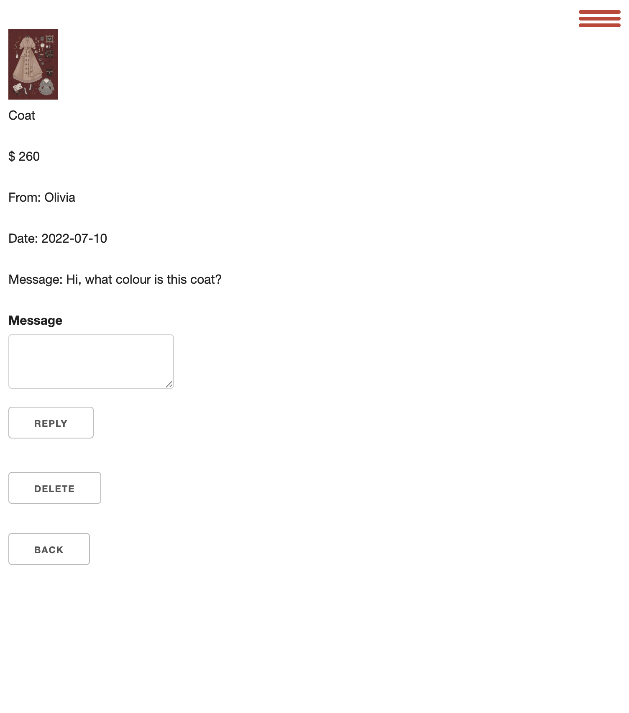
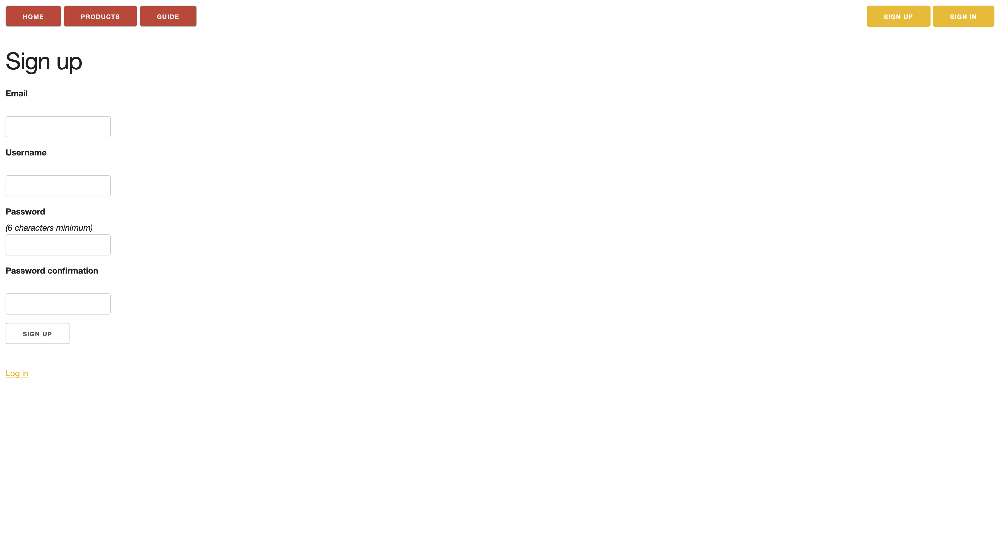

# Marketplace Project - Su Zhang

## Explain how the MVC architecture and concept of inheritance impact the structure of your application and the entities within it

### Structure

Rails follows the MVC architecture to structure an application and as such, divides the application into the pattern’s corresponding parts. A standard Rails application contains an app/ directory containing sub-directories for Models, Views and Controllers. The entities that make up the application core are then divided into the corresponding directories.

Any data related entities that represent database information are placed in the Models directory. View related entities such as HTML layouts and related Rails code is placed in the Views directory and controlling logic code is places in the Controllers directory.

When a request is made to the application, it is routed to the appropriate controller via a list of routes. The controller finds an appropriate view and interacts with models, which in turn interacts with database. The resulting view is then sent as a response from controller. The diagram below shows the process.


### Inheritance

Each MVC component that Rails contains also implements an inheritance structure.

A standard Rails application uses a library called Active Record to implement Models. Each application’s entities, represented by models, inherit from a base class called ActiveRecord. An application’s entity Models can then further inherit each other to create any hierarchical relationship required. This is called Single Table Inheritance (STI).

```rb
class Company < ActiveRecord::Base; end
class Firm < Company; end
class Client < Company; end
class PriorityClient < Client; end
```

This works by Active Record adding a type column to the database table to track the inheritance structure.

Active Record also offers another type of inheritance called Polymorphic Inheritance. This is useful when models do not have a relationship or share data with each other, but still have a relationship with the polymorphic class. This type of inheritance can compromise data integrity however.

Rails views also implement inheritance. A view can be made up on a number of partial views. This prevents the need for duplication across views and reduced the risk of layout inconsistency. It can be achieved using the render keyword which will cause the partial view to be rendered at the position the keyword is used. Rails view inheritance also links closely with Controller inheritance. If a view in not present in the expected location, Rails will follow up the controller’s inheritance tree in an attempt to find an appropriate view at the parent level.

As well as Controllers aiding in View inheritance, since Controllers are just Ruby classes, they also take advantage of Ruby class inheritance. By default, all Rails controllers inherit from ApplicationController. A controller inheriting from another controller will inherit all methods and Actions from the parent unless they are overridden. This can be useful to reduce duplication of code which also reduces the risk of bugs developing or behaviours diverging.

### Resources:
 -  [Ruby on Rails 7.0.3](https://api.rubyonrails.org/classes/ActiveRecord/Inheritance.html)
 - [Rails controller inheritance](https://stackoverflow.com/questions/12286333/rails-controller-inheritance)
 - [Rails View Template Inheritance](https://tweetegy.com/2014/04/rails-view-template-inheritance/)

---

## R7 Identification of the problem you are trying to solve by building this particular marketplace app.

Society values the latest trends, the most fashionable clothing and the most stylish looks, and we rarely think about the environmental impact of our shopping habits. The desire to supply the latest fashion trends in abundance at low prices has led to the fashion industry becoming one of the world's major polluting industries. The industry is responsible for nearly 10% of greenhouse gas emissions, mainly due to the overproduction of clothing to meet consumer demand for "fast fashion". Things are cheap and throwaway, with only about 20% of clothing Recycled or reused, while vast quantities of fashion products end up in landfills or incinerated, creating huge carbon emissions. This call for cheap clothing to keep up with changing trends has devastating effects on our climate.

### References:

- [Climate crisis drives shift towards sustainable fashion](https://www.wipo.int/ip-outreach/zh/ipday/2020/articles/sustainable_fashion.html)

---

## R8 Why is it a problem that needs solving?

Clothes have traditionally been made from materials derived from plants and animals, such as cotton, linen and leather, but today's clothing is increasingly likely to be made from materials derived from fossil fuel crude oil to make nylon and polyester and more synthetic fibres. These materials do not biodegrade, which means significant damage to the environment and devastating effects on human health and wildlife.
At the same time, the high water consumption in the production of clothing, chemical pollution from dyeing and processing, and the disposal of large quantities of unsold or discarded clothing through incineration or landfilling can all cause serious harm to the environment. Therefore, in order to make our world a better place, this should be given enough attention.

### References:

- [Fashion forward: How to combat climate change through clothing](https://www.imperial.ac.uk/stories/fashion-forward/)


---

## R9 A link (URL) to your deployed app (i.e. website)

[App Link](https://vintagemarket.herokuapp.com/)

---

## R10 A link to your GitHub repository (repo).

[Github Repo Link](https://github.com/coderGirlSu/SuZhang_T2A2)

---

## R11 Description of your marketplace app (website), including:

### Purpose

As the problem of global warming worsens, and the popularity of fast fashion brands. Little attention has been paid to the impact of the shopping habits that people develop to follow trends in our living environment. Therefore, I designed this two-sided marketplace, which is based on the protection of the environment to encourage everyone to recycle their own effective resources, sell or buy their own old items, and develop shopping habits that are not wasteful, so as to protect our only and beautiful earth.

### Functionality / features

**Hamburger menu:** This website is responsive, which means it shows a hamburger menu when the screen size is under 1200px instead of showing the navigation menu.

**My orders:** The ability to list all the products a user has ordered. Users will be able to view all their orders on this page.

**My products:** The ability to list all of the products that a user has posted for sale. It is easy for users to manage their products.

**Product search:** Users can search for products they are interested in and narrow down the range of products using a search bar located on the top of the products and my products pages.

**Messaging:** A two way messaging system between buyers and sellers allowing direct communication with context links to the products in question.

**Image uploading:** Upload of product images being sold to give users a clearer picture of the product they are viewing.

**Edit and Add a product:** The ability to edit, delete and add  products to the site website by and user.

**Rich text product descriptions:** Rich Text is a field type that enables users to create rich text content for their product listings. It provides common text formatting options such as paragraphs, adding files, etc.

**Authentication:** Secure authentication of users using Devise to ensure customer information and product listing are secure on the application.

**Authorization:** Secure access restrictions on what can be accessed and edited including editing listed products and accessing customer sent messages.

### Sitemap


### Screenshots

#### Home Page

Website:


Tablet:


Mobile:

#### Products Page

Website:


Tablet:


#### New Product Page

Website:


Tablet:


#### Editing Product Page

Website:


Tablet:


#### Editing Page

Website:


Tablet:


#### Guid Page

Website:


Tablet:


#### Message page(click on picture to link to corresponding product page)

Website:


Tablet:



#### Messages Listing Page

Website:


Tablet:


#### My Orders Listing Page

Website:


Tablet:


#### My Products Page

Website:


Tablet:


#### Search Page

Website:


Tablet:


#### Sold Out Page

Website:


Tablet:


#### Sign In Page

Website:


Tablet:


#### Sign up Page

Website:



Tablet:


### Target audience

The target audience is all people who pay attention to and value global warming and environmental protection, as well as vintage lovers. In this vintage market app, users can sell their old items as sellers, and can also buy their favourite vintage items from other sellers. On this platform, people’s purchasing habit of recycling not only facilitates users to dispose of their old items but also reduces the environmental pollution caused by high carbon emissions when incinerating discarded items.

### Tech stack (e.g. html, css, deployment platform, etc)

- Visual Studio Code - An Integrated Development Environment (IDE) for writing code in a large number of languages
- Ruby on Rails - A Ruby framework for developing web based applications in Rails
- Ruby - A popular coding language
- PostgreSQL- A popular free and open-source database management system used in development and production environments
- Heroku - A cloud hosting platform used to host the staging and production environment and control the deployment pipeline
- HTML - Layout language used to build the user interface of the application
- CSS - Styling language used to style the user interface of the application
- GitHub - A cloud source control platform used to track changes and as part of the deployment pipeline
- draw.io - An free online tool to draw diagrams used to draw the ERD for this application
- XMind - A application used to draw mind maps. Used to draw the sitemap
- Balsamiq Wireframes - A tool to draw user interface wireframes

---

## R12 User stories for your app

User's perspective:

- As a user, I want to be able to register and log in to the site, so that I can sell my products or buy products.

Buyer's perspective:

- As a buyer, I want to be able to search for related items, so that I can find items I'm interested in faster.
- As a buyer, I want to see a list of the items I've purchased，so that I can easily see all the information about the items I've purchased.
- As a buyer, I want to send messages to sellers, so that I can easily inquire about the specifics of the item I want to buy.
- As a buyer, I want to understand the terms that describe the condition of used goods, so that I can know the condition of the goods before I purchase something.
- As a buyer, I want to be able to purchase goods and confirm that the purchase has been successful, so that I can obtain the goods I like and be confident the purchase was successful.
- As a buyer, I want to know which items are sold out, so that I don't try to buy them.
- As a buyer, I want to see all product listings without registering or logging in, so that I can be sure if this is the type of site I'm looking for.

Seller's perspective:

- As a seller, I want to have a section that displays all of my products listing, so that I can easily see how all of my listings are selling.
- As a seller, I want to have a section where I can view and reply to messages, so that I can easily view all the inquiries sent to me by buyers and reply in a timely manner.
- As a seller, I want the picture and link of the corresponding product can be attached to the buyer's inquiry message, so that I can clearly know which product the buyer is inquiring about and quickly find the information for the product.
- As a seller, I want to have an obvious and convenient button to add new items, so that I can add items that I want to sell at any time.
- As a seller, I want to be able to edit my products, so that I can update or delete the products I list at any time, and also buyers can get the latest product information.
- As a seller, I want to be able to upload images and describe items' conditions, so that buyers can clearly know the detailed condition of the product.

---

## R13 Wireframes for your app

Home Page

Products Page

Product Buyer-Page

Product Seller-Page

Editing Page

Add New Product Page

Contact Page

Success Page

Sold Out Page

Condition Guide Page

My Products Page

My Orders Page

Message list Page

Reply message Page


---

## R14 An ERD for your app


---

## R15 Explain the different high-level components (abstractions) in your app


---

## R16 Detail any third party services that your app will use

### Heroku (Web hosting service)

Heroku is a Platform as a Service (PaaS) which provides a set of capabilities that allows me to deploy, manage and host my website. I selected to use it because it does not require understanding of server configuration, network management, or how to tune the latest version of the database.

### GitHub

I used GitHub to host my source code and keep track of changes. It makes it easier to review, improve and deliver new features and provides a workflow. I also used it as part of my deployment pipeline to deploy code from Github to Heroku.

### Devise

I used the Devise `gem` to generated a User model in rails as an authentication system. Devise takes care of all the actions necessary for a User, such as logging in and out, sending emails and password for registration. Devise is easy and flexible to configure. I extended it by adding a username property to the User model.

---

## R17 Describe your projects models in terms of the relationships (active record associations) they have with each other

### User

A User can sell their products on the site and as such has a `has_many :products` relationship.

When orders have been placed it is possible to list them all. These orders are divided into two groups. A user can sell many items which is represented with a `has_many :sold_orders` relationship with a specific foreign key and class name of `foreign_key: "seller_id", class_name: "Order"`. Orders for items the user has purchased is achieved with a `has_many :bought_orders` relationship and `foreign_key: "buyer_id", class_name: "Order"`.

Users can send messages between buyers and sellers. To achieve this, two relationships are established. `has_many :messages, foreign_key: "sender_id", class_name: "User"` for messages that the user has sent and `has_many :messages, foreign_key: "receiver_id", class_name: "User"` for messages that the user has received. These will be used in a future implementation.

### Product

Each product belongs to a single category, represented with the `belongs_to :category` relationship. Every product must also belong to a single user, represented with the `belongs_to :user` relationship.

A product has a condition and color property, represented by the corresponding `enum condition` and `enum colour` values.

Products also have of a rich text formatted description and an uploaded picture. These are stored in different entities and have relationships as `has_rich_text :description` and  `has_one_attached :picture`.

### Category

Categories are used to group products and there can be  many products under each category. This is represented with a `has_many :products` relationship.

### Order

When an order is placed, it belongs to a particular product, as such, it is represented with the `belongs_to :product` relationship.

An order also belongs to both a particular buyer and a seller and is represented with the `belongs_to :buyer, foreign_key: "buyer_id", class_name: "User"` and `belongs_to :seller, foreign_key: "seller_id", class_name: "User"` relationships.

### Message

Messages are sent between buyers and sellers and always belong to a sender and receiver. This is represented using a `belongs_to :sender, foreign_key: "sender_id", class_name: "User"` and a `belongs_to :receiver,foreign_key: "receiver_id", class_name: "User"` relationship.

For extra context a message also belongs to a product and this is displayed to a user when viewing the messages. As such a `belongs_to :product` relationship represents this.

---

## R18 Discuss the database relations to be implemented in your application


---

## R19 Provide your database schema design

Active text rich text table

```rb
  create_table "action_text_rich_texts", force: :cascade do |t|
    t.string "name", null: false
    t.text "body"
    t.string "record_type", null: false
    t.bigint "record_id", null: false
    t.datetime "created_at", null: false
    t.datetime "updated_at", null: false
    t.index ["record_type", "record_id", "name"], name: "index_action_text_rich_texts_uniqueness", unique: true
  end
```

Active storage attachments table

```rb
create_table "active_storage_attachments", force: :cascade do |t|
    t.string "name", null: false
    t.string "record_type", null: false
    t.bigint "record_id", null: false
    t.bigint "blob_id", null: false
    t.datetime "created_at", null: false
    t.index ["blob_id"], name: "index_active_storage_attachments_on_blob_id"
    t.index ["record_type", "record_id", "name", "blob_id"], name: "index_active_storage_attachments_uniqueness", unique: true
  end
```

Active storage blobs table

```rb
 create_table "active_storage_blobs", force: :cascade do |t|
    t.string "key", null: false
    t.string "filename", null: false
    t.string "content_type"
    t.text "metadata"
    t.string "service_name", null: false
    t.bigint "byte_size", null: false
    t.string "checksum"
    t.datetime "created_at", null: false
    t.index ["key"], name: "index_active_storage_blobs_on_key", unique: true
  end
```

Active storage database files (used for image uploading)

```rb
create_table "active_storage_db_files", force: :cascade do |t|
    t.string "ref", null: false
    t.binary "data", null: false
    t.datetime "created_at", precision: nil, null: false
    t.index ["ref"], name: "index_active_storage_db_files_on_ref", unique: true
  end
```

Active storage variant records (for edits to images)

```rb
 create_table "active_storage_variant_records", force: :cascade do |t|
    t.bigint "blob_id", null: false
    t.string "variation_digest", null: false
    t.index ["blob_id", "variation_digest"], name: "index_active_storage_variant_records_uniqueness", unique: true
  end
```

Category database table

```rb
create_table "categories", force: :cascade do |t|
    t.string "name"
    t.datetime "created_at", null: false
    t.datetime "updated_at", null: false
  end
```

Message database table

```rb
 create_table "messages", force: :cascade do |t|
    t.text "message"
    t.bigint "product_id", null: false
    t.date "date"
    t.bigint "sender_id", null: false
    t.bigint "receiver_id", null: false
    t.datetime "created_at", null: false
    t.datetime "updated_at", null: false
    t.index ["product_id"], name: "index_messages_on_product_id"
    t.index ["receiver_id"], name: "index_messages_on_receiver_id"
    t.index ["sender_id"], name: "index_messages_on_sender_id"
  end
```

Order database table

```rb
create_table "orders", force: :cascade do |t|
    t.bigint "product_id", null: false
    t.bigint "buyer_id", null: false
    t.bigint "seller_id", null: false
    t.date "date"
    t.boolean "paid"
    t.datetime "created_at", null: false
    t.datetime "updated_at", null: false
    t.index ["buyer_id"], name: "index_orders_on_buyer_id"
    t.index ["product_id"], name: "index_orders_on_product_id"
    t.index ["seller_id"], name: "index_orders_on_seller_id"
  end
```

Product database table

```rb
create_table "products", force: :cascade do |t|
    t.string "title"
    t.boolean "sold", default: false
    t.bigint "category_id", null: false
    t.bigint "user_id", null: false
    t.integer "price"
    t.integer "colour"
    t.integer "condition"
    t.date "listed_date"
    t.datetime "created_at", null: false
    t.datetime "updated_at", null: false
    t.index ["category_id"], name: "index_products_on_category_id"
    t.index ["user_id"], name: "index_products_on_user_id"
  end
```

User database table

```rb
create_table "users", force: :cascade do |t|
    t.string "email", default: "", null: false
    t.string "encrypted_password", default: "", null: false
    t.string "reset_password_token"
    t.datetime "reset_password_sent_at"
    t.datetime "remember_created_at"
    t.string "username"
    t.datetime "created_at", null: false
    t.datetime "updated_at", null: false
    t.string "address"
    t.index ["email"], name: "index_users_on_email", unique: true
    t.index ["reset_password_token"], name: "index_users_on_reset_password_token", unique: true
  end
```

Foreign Keys

```rb
  add_foreign_key "active_storage_attachments", "active_storage_blobs", column: "blob_id"
  add_foreign_key "active_storage_variant_records", "active_storage_blobs", column: "blob_id"
  add_foreign_key "messages", "products"
  add_foreign_key "messages", "users", column: "receiver_id"
  add_foreign_key "messages", "users", column: "sender_id"
  add_foreign_key "orders", "products"
  add_foreign_key "orders", "users", column: "buyer_id"
  add_foreign_key "orders", "users", column: "seller_id"
  add_foreign_key "products", "categories"
  add_foreign_key "products", "users"
```

---

## R20 Describe the way tasks are allocated and tracked in your project

The tool I used to manage my project was Trello. Trello is a free visual organisation tool that uses a Kanban workflow style to track tasks and manage workflows.

I used a Trello board to allocate and track my project, the board was arranged in 5 columns, they were:

- Optional features - records the tasks I want to implement, but are not mandatory requirements
- To do - records the tasks that must be done are in the To do list column
- Doing - records the tasks that I am doing, but are not necessarily being done today
- Today - records the tasks that have to be completed today
- Done - records completed tasks, to make sure I've done all the tasks

### Task properties

Each task has a label and story points. I created 7 labels to organise each ticket, they are presentation, database, features, blocked, slides and documentation. The story points categorize difficulty levels and use the Fibonacci sequence. The Trello board screenshots and the link are shown below.

[Trello Board Link](https://trello.com/b/D1Iluvdr/marketpalce)

### My process

Every day I select a few tasks from the Doing list that I want to complete and move them to the Today list. This helps me focus on what needs to be done right now. Once tasks are complete, I move them to the Done list. If I become blocked on a task I can park it in Doing and focus on a different task in the Today list.

Once the Today list is empty I select more tasks from the Doing list and move them to the Today list. 

If all the To Do tasks are completed, I will move another ticket from the Optional features list over to the Doing list. 

### Trello board Screenshot


---